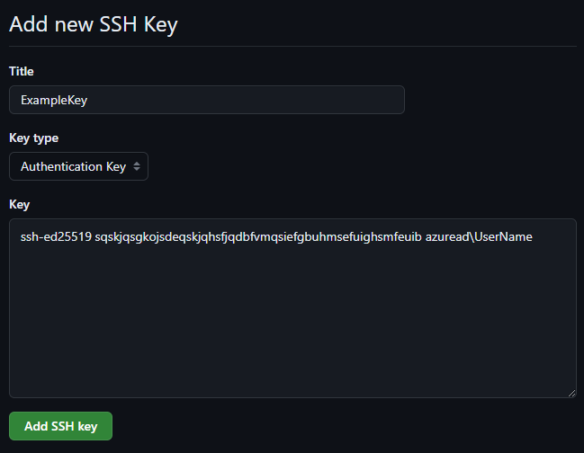
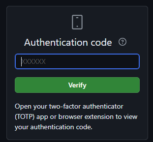
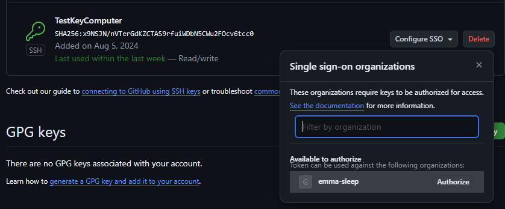

# IT PAW Setup
This repository is used to setup our IT Privileged Access Workstations (PAW).

## Prerequisites

Before you install your PAW, you need to have access to Github. 
Please follow the instruction given in our Whizzz card:

https://whizzz.emma-sleep.com/share/card/how-to-become-member-to-emma-github-jZlfdeO

## Installation

Open a PowerShell prompt (as an Administrator) and run the following command:

```powershell
Set-ExecutionPolicy Bypass -Scope Process -Force; iex ((New-Object System.Net.WebClient).DownloadString('https://raw.githubusercontent.com/emma-sleep/it-paw-setup/main/install-paw.ps1'))
```

And that's it! 

## Notes about Github SSH key

At some point in the script, you will be asked to create a SSH key and add it to your Github account. 

### Adding your key into your Github Account

To add your newly created key, you will see the public key output in the script:

```
Write-Host "---------- SSH Key --------------"
ssh-ed25519 sqskjqsgkojsdeqskjqhsfjqdbfvmqsiefgbuhmsefuighsmfeuib azuread\UserName
Write-Host "---------- End ------------------"
```

You need to only copy the part **between** the two lines into Github and select the key type as *Authentication Key*:



You will be then added to authenticate with your Auth code (or alternative 2FA method)



### Authorizing your key for the organization

Once the key was added, you also need to authorize it for the for Single sign-on organization by selecting the organization "emma-sleep":



Your key is now added for authentication!